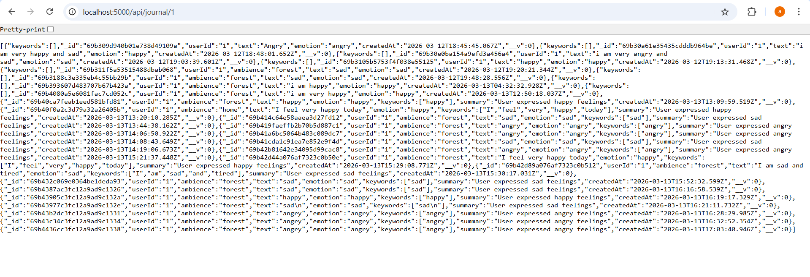
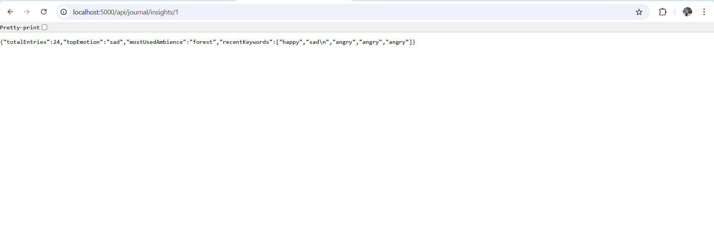
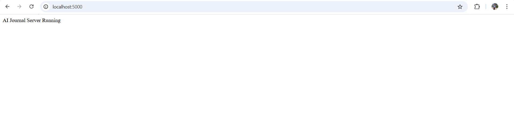

# AI-Assisted Journal System

This project is a full stack AI-assisted journal system built as part of the ArvyaX Full Stack Assessment.

The system allows users to write journal entries after immersive nature sessions and analyze their emotional state using AI techniques.

--------------------------------------------------

## Problem Statement

ArvyaX users complete immersive nature sessions such as:

- Forest
- Ocean
- Mountain

After each session they write a journal entry.

The system should:

1. Store journal entries
2. Analyze emotions using AI
3. Show insights about the user’s mental state over time

--------------------------------------------------

## Core Features

### 1. Journal Entry API

Endpoint:

POST /api/journal

Example request:

{
"userId": "123",
"ambience": "forest",
"text": "I felt calm today after listening to the rain"
}

This API stores journal entries in MongoDB.

--------------------------------------------------

### 2. Get Journal Entries

Endpoint:

GET /api/journal/:userId

This returns all journal entries for a specific user.

--------------------------------------------------

### 3. Emotion Analysis API

Endpoint:

POST /api/journal/analyze

Example Input:

{
"text": "I felt calm today after listening to the rain"
}

Example Output:

{
"emotion": "calm",
"keywords": ["rain", "nature", "peace"],
"summary": "User experienced relaxation during the forest session"
}

This analyzes text and extracts:

- Emotion
- Keywords
- Summary

--------------------------------------------------

### 4. Insights API

Endpoint:

GET /api/journal/insights/:userId

Example Output:

{
"totalEntries": 8,
"topEmotion": "calm",
"mostUsedAmbience": "forest",
"recentKeywords": ["nature","rain","focus"]
}

This provides insights about user mental patterns.

--------------------------------------------------

## Minimal Frontend

A simple React frontend is implemented where the user can:

- Write journal entries
- View previous entries
- Analyze journal text
- View insights

--------------------------------------------------

## Tech Stack

Frontend:
React

Backend:
Node.js
Express.js

Database:
MongoDB

--------------------------------------------------

## Running the Project

### Start Backend

cd ai-journal
node server.js

Backend runs on:

http://localhost:5000

--------------------------------------------------

### Start Frontend

cd ai-journal-frontend
npm start

Frontend runs on:

http://localhost:3000

--------------------------------------------------
## System Architecture

The system follows a simple full stack architecture.

React Frontend sends HTTP requests to the backend APIs.

Backend processes the request using Express.js and stores or retrieves data from MongoDB.

Flow:

React Frontend  
↓  
Node.js + Express API  
↓  
MongoDB Database

--------------------------------------------------

## Project Structure

ai-journal

server.js  
models  
 └── Journal.js  

client  
 ├── public  
 └── src  
     └── App.js  

README.md  
ARCHITECTURE.md  
package.json

--------------------------------------------------

## Environment Setup

Install dependencies:

npm install

Make sure MongoDB is running locally.

Start backend server:

node server.js

Start frontend:

cd client  
npm start
## API Screenshots

### Get journal API

### insight Journal API

### localhost API

## Author

Ankit Raj
B.Tech CSE